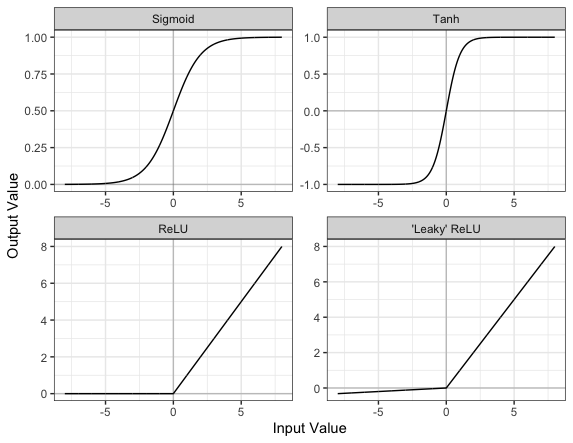
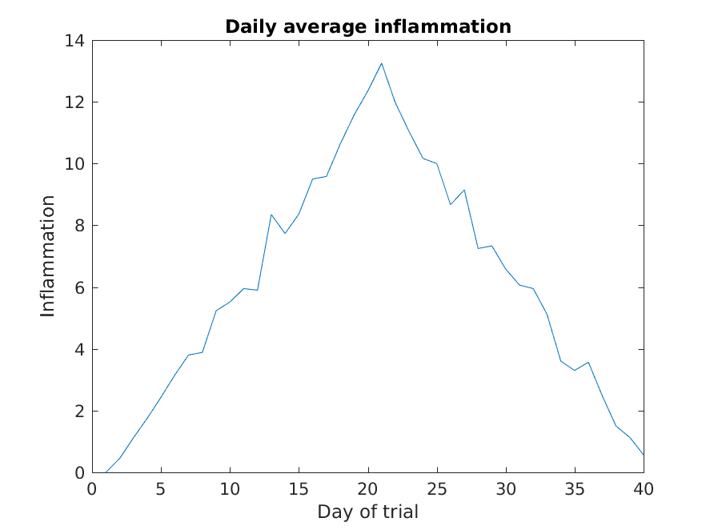
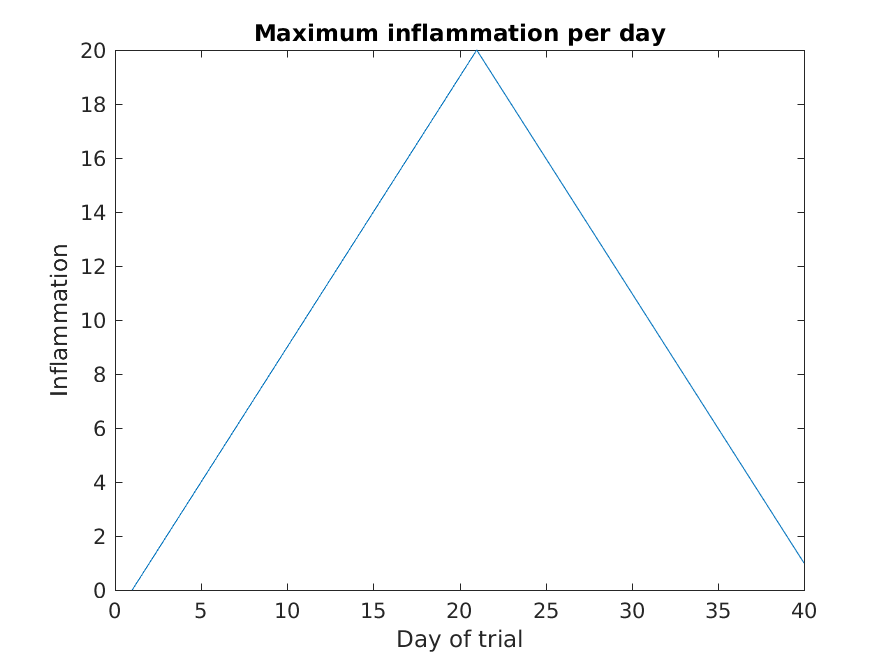
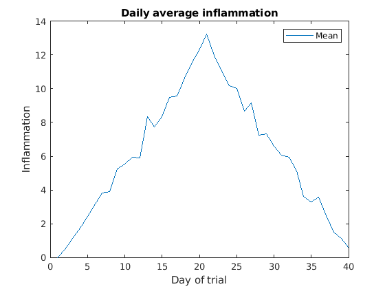

::::::::::::::::::::::::::::::::::::::: objectives

objectives:
- "Become familiar with key components of a neural network."
- "Create the architecture for a convolutational neural network."

::::::::::::::::::::::::::::::::::::::::::::::::::

:::::::::::::::::::::::::::::::::::::::: questions

- "What is a neural network?"
- "What are the characteristics of a dense layer?"
- "What is an activation function?"
- "What is a convolutional neural network?"

::::::::::::::::::::::::::::::::::::::::::::::::::

:::::::::::::::::::::::::::::::::::::::: keypoints

- "Dense layers, also known as fully connected layers, are an important building block in most neural network architectures. In a dense layer, each neuron is connected to every neuron in the preceeding layer."
- "Dropout is a method that helps to prevent overfitting by temporarily removing neurons from the network."
- "The Rectified Linear Unit (ReLU) is an activation function that outputs an input if it is positive, and outputs zero if it is not."
- "Convolutional neural networks are typically used for imaging tasks."

::::::::::::::::::::::::::::::::::::::::::::::::::


## What is a neural network?

An artificial neural network, or just “neural network”, is a broad term that describes a family of machine learning models that are (very!) loosely based on the neural circuits found in biology.

The smallest building block of a neural network is a single neuron. A typical neuron receives inputs (x1, x2, x3) which are multiplied by learnable weights (w1, w2, w3), then summed with a bias term (b). An activation function (f) determines the neuron output.

{alt="An example neuron receiving input from 3 other neurons"}

From a high level, a neural network is a system that takes input values in an “input layer”, processes these values with a collection of functions in one or more “hidden layers”, and then generates an output such as a prediction. The network has parameters that are systematically tweaked to allow pattern recognition.

{a;t="A simple neural network with input, output, and 2 hidden layers"}

The layers shown in the network above are "dense" or "fully connected". Each neuron is connected to all neurons in the preceeding layer. Dense layers are a common building block in neural network architectures.

“Deep learning” is an increasingly popular term used to describe certain types of neural network. When people talk about deep learning they are typically referring to more complex network designs, often with a large number of hidden layers.

## Activation Functions

Part of the concept of a neural network is that each neuron can either be 'active' or 'inactive'. This notion of activity and inactivity is attempted to be replicated by so called activation functions. The original activation function was the sigmoid function (related to its use in logistic regression). This would make each neuron's activation some number between 0 and 1, with the idea that 0 was 'inactive' and 1 was 'active'.

As time went on, different activation functions were used. For example the tanh function (hyperbolic tangent function), where the idea is a neuron can be active in both a positive capacity (close to 1), a negative capacity (close to -1) or can be inactive (close to 0).

The problem with both of these is that they suffered from a problem called [model saturation](http://vigir.missouri.edu/~gdesouza/Research/Conference_CDs/IEEE_SSCI_2015/data/7560b423.pdf). This is where very high or very low values are put into the activation function, where the gradient of the line is almost flat. This leads to very slow learning rates (it can take a long time to train models with these activation functions).

Another very popular activation function that tries to tackle this is the rectified linear unit (ReLU) function. This has 0 if the input is negative (inactive) and just gives back the input if it is positive (a measure of how active it is - the metaphor gets rather stretched here). This is much faster at training and gives very good performance, but still suffers model saturation on the negative side. Researchers have tried to get round this with functions like 'leaky' ReLU, where instead of returning 0, negative inputs are multiplied by a very small number.

{alt="Plots of the Sigmoid, Tanh, ReLU, and Leaky ReLU activation functions"}

## Convolutional neural networks

Convolutional neural networks (CNNs) are a type of neural network that especially popular for vision tasks such as image recognition. CNNs are very similar to ordinary neural networks, but they have characteristics that make them well suited to image processing.

Just like other neural networks, a CNN typically consists of an input layer, hidden layers and an output layer. The layers of "neurons" have learnable weights and biases, just like other networks.

What makes CNNs special? The name stems from the fact that the architecture includes one or more convolutional layers. These layers apply a mathematical operation called a "convolution" to extract features from arrays such as images.

In a convolutional layer, a matrix of values referred to as a "filter" or "kernel" slides across the input matrix (in our case, an image). As it slides, values are multiplied to generate a new set of values referred to as a "feature map" or "activation map".

{alt="2D Convolution Animation by Michael Plotke"}

Filters provide a mechanism for emphasising aspects of an input image. For example, a filter may emphasise object edges. See [setosa.io](https://setosa.io/ev/image-kernels/) for a visual demonstration of the effect of different filters.

## Creating a convolutional neural network

Before training a convolutional neural network, we will first need to define the architecture. We can do this using the Keras and Tensorflow libraries.

```python
# Create the architecture of our convolutional neural network, using
# the tensorflow library
from tensorflow.random import set_seed
from tensorflow.keras.layers import Dense, Dropout, Conv2D, MaxPool2D, Input, GlobalAveragePooling2D
from tensorflow.keras.models import Model

# set random seed for reproducibility
set_seed(42)
 
# Our input layer should match the input shape of our images.
# A CNN takes tensors of shape (image_height, image_width, color_channels)
# We ignore the batch size when describing the input layer
# Our input images are 256 by 256, plus a single colour channel.
inputs = Input(shape=(256, 256, 1))

# Let's add the first convolutional layer
x = Conv2D(filters=8, kernel_size=3, padding='same', activation='relu')(inputs)

# MaxPool layers are similar to convolution layers. 
# The pooling operation involves sliding a two-dimensional filter over each channel of feature map and selecting the max values.
# We do this to reduce the dimensions of the feature maps, helping to limit the amount of computation done by the network.
x = MaxPool2D()(x)

# We will add more convolutional layers, followed by MaxPool
x = Conv2D(filters=8, kernel_size=3, padding='same', activation='relu')(x)
x = MaxPool2D()(x)
x = Conv2D(filters=12, kernel_size=3, padding='same', activation='relu')(x)
x = MaxPool2D()(x)
x = Conv2D(filters=12, kernel_size=3, padding='same', activation='relu')(x)
x = MaxPool2D()(x)
x = Conv2D(filters=20, kernel_size=5, padding='same', activation='relu')(x)
x = MaxPool2D()(x)
x = Conv2D(filters=20, kernel_size=5, padding='same', activation='relu')(x)
x = MaxPool2D()(x)
x = Conv2D(filters=50, kernel_size=5, padding='same', activation='relu')(x)

# Global max pooling reduces dimensions back to the input size
x = GlobalAveragePooling2D()(x)

# Finally we will add two "dense" or "fully connected layers".
# Dense layers help with the classification task, after features are extracted.
x = Dense(128, activation='relu')(x)

# Dropout is a technique to help prevent overfitting that involves deleting neurons.
x = Dropout(0.6)(x)

x = Dense(32, activation='relu')(x)

# Our final dense layer has a single output to match the output classes.
# If we had multi-classes we would match this number to the number of classes.
outputs = Dense(1, activation='sigmoid')(x)

# Finally, we will define our network with the input and output of the network
model = Model(inputs=inputs, outputs=outputs)
```

We can view the architecture of the model:

```python
model.summary()
```

```output
Model: "model_39"
_________________________________________________________________
 Layer (type)                Output Shape              Param #   
=================================================================
 input_9 (InputLayer)        [(None, 256, 256, 1)]     0         
                                                                 
 conv2d_59 (Conv2D)          (None, 256, 256, 8)       80        
                                                                 
 max_pooling2d_50 (MaxPoolin  (None, 128, 128, 8)      0         
 g2D)                                                            
                                                                 
 conv2d_60 (Conv2D)          (None, 128, 128, 8)       584       
                                                                 
 max_pooling2d_51 (MaxPoolin  (None, 64, 64, 8)        0         
 g2D)                                                            
                                                                 
 conv2d_61 (Conv2D)          (None, 64, 64, 12)        876       
                                                                 
 max_pooling2d_52 (MaxPoolin  (None, 32, 32, 12)       0         
 g2D)                                                            
                                                                 
 conv2d_62 (Conv2D)          (None, 32, 32, 12)        1308      
                                                                 
 max_pooling2d_53 (MaxPoolin  (None, 16, 16, 12)       0         
 g2D)                                                            
                                                                 
 conv2d_63 (Conv2D)          (None, 16, 16, 20)        6020      
                                                                 
 max_pooling2d_54 (MaxPoolin  (None, 8, 8, 20)         0         
 g2D)                                                            
                                                                 
 conv2d_64 (Conv2D)          (None, 8, 8, 20)          10020     
                                                                 
 max_pooling2d_55 (MaxPoolin  (None, 4, 4, 20)         0         
 g2D)                                                            
                                                                 
 conv2d_65 (Conv2D)          (None, 4, 4, 50)          25050     
                                                                 
 global_average_pooling2d_8   (None, 50)               0         
 (GlobalAveragePooling2D)                                        
                                                                 
 dense_26 (Dense)            (None, 128)               6528      
                                                                 
 dropout_8 (Dropout)         (None, 128)               0         
                                                                 
 dense_27 (Dense)            (None, 32)                4128      
                                                                 
 dense_28 (Dense)            (None, 1)                 33        
                                                                 
=================================================================
Total params: 54,627
Trainable params: 54,627
Non-trainable params: 0
_________________________________________________________________
```


## MATLAB


## Plotting
The mathematician Richard Hamming once said,
"The purpose of computing is insight, not numbers," and the best
way to develop insight is often to visualize data. Visualization
deserves an entire lecture (or course) of its own, but we can
explore a few features of MATLAB here.

We will start by exploring the function `plot`.
The most common usage is to provide two vectors, like `plot(X,Y)`.
Lets start by plotting the the average (accross patients) inflammation over time.
For the `Y` vector we can provide `per_day_mean`,
and for the `X` vector we can simply use the day number,
which we can generate as a range with `1:40`.
Then our plot can be generated with:
```matlab
>> plot(1:40,per_day_mean)
```

:::::::::::::::::::::::::::::::::::::::::  callout

**Note:** If we only provide a vector as an argument it plots a data-point for each value on the y axis,
and it uses the index of each element as the x axis.
For our patient data the indices coincide with the day of the study,
so `plot(per_day_mean)` generates the same plot.
In most cases, however, using the indices on the x axis is not desireable.

::::::::::::::::::::::::::::::::::::::::::::::::::


:::::::::::::::::::::::::::::::::::::::::  callout

**Note:** We do not even need to have the vactor saved as a variable.
We would obtain the same plot with the command `plot(mean(patient_data, 1))`.

::::::::::::::::::::::::::::::::::::::::::::::::::

As it is, the image is not very informative.
We need to give the figure a `title` and label the axes using `xlabel` and `ylabel`,
so that other people can understand what it shows
(including us if we return to this plot 6 months from now).
```matlab
>> title('Daily average inflammation')
>> xlabel('Day of trial')
>> ylabel('Inflammation')
```

{alt='Average inflammation'}

Much better, now the image actually communicates something.

The result is roughly a linear rise and fall, which is suspicious:
based on other studies, we expect a sharper rise and slower fall.
Let's have a look at two other statistics: the maximum and minimum
inflammation per day across all patients.
```matlab
>> plot(per_day_max)
>> title('Maximum inflammation per day')
>> ylabel('Inflammation')
>> xlabel('Day of trial')
```

{alt='Maximum inflammation'}

```matlab
>> plot(per_day_min)
>> title('Minimum inflammation per day')
>> ylabel('Inflammation')
>> xlabel('Day of trial')
```

{alt='Minumum inflammation'}

From the figures, we see that the maximum value rises and falls perfectly
smoothly, while the minimum seems to be a step function. Neither result
seems particularly likely, so either there's a mistake in our
calculations or something is wrong with our data.

## Multiple lines in a plot

It is often the case that we want more than one line in a single plot.
In matlab we can "hold" a plot and keep plotting on top.
For example, we might want to contrast the mean values accross patients
with the information of a single patient.
If we are displaying more than one line, it is important we add a legend.
We can specify the legend names by adding `,'DisplayName',"legend name here"`
inside the plot function. We then need to activate the legend by running `legend`
So, to plot the mean values we first do:
```matlab
>> plot(per_day_mean,'DisplayName',"Mean")
>> legend
>> title('Daily average inflammation')
>> xlabel('Day of trial')
>> ylabel('Inflammation')
```

{alt='Average inflamation with legend'}

Then, we can use the instruction `hold on` to add a plot for patient_5.
```matlab
>> hold on
>> plot(patient_5,'DisplayName',"Patient 5")
>> hold off
```

{alt='Average inflamation and Patient 5'}

Remember to tell matlab you are done by adding `hold off` when you are done!


## Subplots

It is often convenient to combine multiple plots into one figure.
The `subplot(m,n,p)`command allows us to do just that.
The first two parameter define a grid of `m` rows and `n` columns,
in which our plots will be placed.
The third parameter indicates the position on the grid that we want to use for the "next" plot command.
For example, we can show the average daily min and max plots together with:
```matlab
>> subplot(1, 2, 1)
>> plot(per_day_max)
>> ylabel('max')
>> xlabel('day')

>> subplot(1, 2, 2)
>> plot(per_day_min)
>> ylabel('min')
>> xlabel('day')
```

{alt='Max Min subplot'}


## Heatmaps

If we wanted to look at all our data at the same time we need a three dimensions:
One for the patients, one for the days, and another one for the inflamation values.
An option is to use a heatmap, that is, use the colour of each point to represent the inflamation values.

In matlab, at least two methods can do this for us. 
The [`heatmap` function](https://uk.mathworks.com/help/matlab/ref/heatmap.html)
takes a table as input and produces a heatmap:
```matlab
>> heatmap(patient_data)
>> title('Inflammation')
>> xlabel('Day of trial')
>> ylabel('Patient number')
```

{alt='Heat map'}

We gain something by visualizing the whole dataset at once,
but it is harder to distinwish the overly linear rises and fall over a 40 day period.

Similarly, the [`imagesc` function](https://uk.mathworks.com/help/matlab/ref/imagesc.html)
represents the matrix as a color image. 
```matlab
>> imagesc(patient_data)
>> title('Inflammation')
>> xlabel('Day of trial')
>> ylabel('Patient number')
```

{alt='imagesc Heat map'}

Every value in the matrix is *mapped* to a color. 
Blue regions in this heat map are low values, while yellow shows high values.

Both functions provide very similar information, and can be tweaked to your liking.
The `imagesc` function is usually only used for purely numerical arrays,
whereas `heatmap` can process [tables](https://uk.mathworks.com/help/matlab/ref/table.html)
(that can have strings or categories in them).
In our case, which one you use is a matter of taste.

### Is all our data corrupt?
Our work so far has convinced us that something is wrong with our
first data file. We would like to check the other 11 the same way,
but typing in the same commands repeatedly is tedious and error-prone.
Since computers don't get bored (that we know of), we should create a
way to do a complete analysis with a single command, and then figure out
how to repeat that step once for each file. These operations are the
subjects of the next two lessons.


